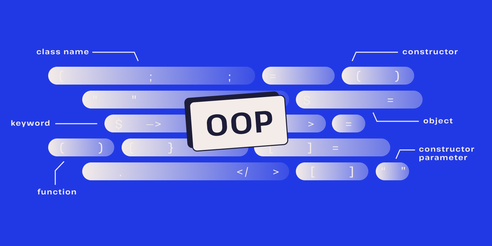

# Object-Oriented Programming Projects in C++

  

This repository contains a collection of C++ projects that demonstrate some Object-Oriented Programming (OOP) concepts. Each project focuses on a specific aspect of OOP, providing practical examples for encapsulation, inheritance, polymorphism, operator overloading, and linked lists.

## Projects Overview

### 1. **Metro Simulation with Doubly Linked Lists**
This project simulates metro trains moving along metro lines. The simulation is built using doubly linked lists to store metro stations and their connections.

**OOP Concepts Demonstrated:**
- Encapsulation
- Dynamic memory allocation
- Doubly linked lists

[Detailed Readme](./metro_simulation/README.md)

---

### 2. **Call Center Reservation System with Transport Hierarchy**
This project models a call center that handles accommodation reservations and transport bookings. The system supports various types of transport like flights, trains, and self-organized travel. It uses inheritance to define transport classes and polymorphism for method overriding.

**OOP Concepts Demonstrated:**
- Inheritance
- Polymorphism
- Encapsulation
- Class hierarchies

[Detailed Readme](./call_center_reservation/README.md)

---

### 3. **Postal Code and City Linked List in C++**
This project reads a CSV file containing German postal codes and city names, and organizes them into a singly linked list. It provides a lookup functionality based on postal code ranges.

**OOP Concepts Demonstrated:**
- Singly linked lists
- File handling
- Encapsulation

[Detailed Readme](./postal_code_linked_list/README.md)

---

### 4. **Two's Complement Bitwise Operations with Operator Overloading**
This project implements a two's complement number system, with operator overloading to perform bitwise operations such as addition, subtraction, negation, and equality checks.

**OOP Concepts Demonstrated:**
- Operator overloading
- Bitwise operations
- Encapsulation

[Detailed Readme](./twos_complement_operations/README.md)

---

## Requirements

- **C++11** or later
- Standard C++ libraries (`iostream`, `fstream`, etc.)

## Usage

Each project contains its own `README.md` file with detailed usage instructions and examples. Follow the links above to get instructions for each project.

