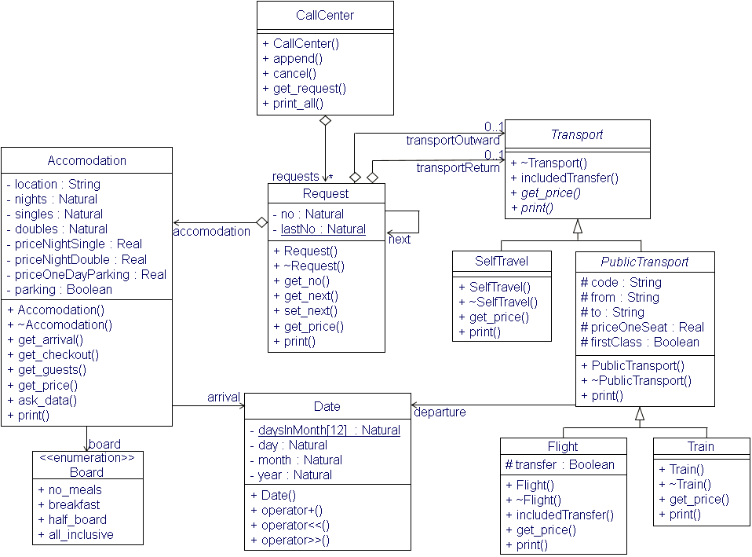

# Call Center Booking Request System


  


## Project Overview

This project simulates a call center system that manages booking requests for accommodations and travel (flight, train, or self-organized). The system allows users to create, store, and manage reservation requests, including transport details for outward and return journeys. It features an interactive menu system that lets users enter accommodation and transport details, print requests, and manage bookings.

## Features

- **Accommodation Booking**: Allows booking for accommodations with details like location, number of nights, room types (single/double), and parking.
- **Meal Options**: Users can select meal options like no meals, breakfast, half board, or all-inclusive, with prices calculated accordingly.
- **Transport Booking**: Provides options for transport bookings via self-travel, flight, or train with price variations for first-class or standard seats.
- **Linked List for Requests**: A linked list data structure stores the requests in the system, allowing users to append, search, and delete requests.
- **Total Price Calculation**: The system calculates the total price for the accommodation and transport (if booked) and displays it to the user.
- **Menu-Driven Interaction**: Users interact with the system through a menu that offers options to create new requests, show all requests, and manage existing requests.

### Usage

The program will prompt you with a menu to manage reservation requests and transportation details for a call center. The menu options include:

- **Create a new standard reservation request**: Enter details such as the location of accommodation, arrival date, number of nights, single and double room counts, board type (all-inclusive, half board, breakfast, or no meals), and parking options. You will also be asked to provide details for transport outward and return (flight, train, or self-travel). The price will be calculated based on the selected options.
  
- **Create a new superior reservation request**: Similar to the standard reservation, but with higher pricing for rooms.

- **Display a reservation request**: Enter the reservation number to view the details of that specific request, including accommodation, guest count, transport, and the total price.

- **Display all reservation requests**: Output the details of all active reservation requests in the call center.

- **Cancel a reservation request**: After viewing a specific request, you can optionally cancel it by removing it from the list of requests.

## OOP Concepts Demonstrated

1. **Classes and Objects**: The project defines multiple classes like `CallCenter`, `Request`, `Accomodation`, `Transport`, `PublicTransport`, `Flight`, and `Train`.
2. **Inheritance**: `PublicTransport`, `Flight`, and `Train` classes inherit from a common base class `Transport`.
3. **Polymorphism**: Virtual methods in the `Transport` class are overridden in its derived classes for custom behavior.
4. **Encapsulation**: Each class has private attributes and public methods that manage the data.
5. **Dynamic Memory Management**: The system manages memory dynamically by creating and deleting booking requests.
6. **Operator Overloading**: Various operators are overloaded, such as the output operator to print details of the requests.
7. **Linked Lists**: Requests are stored and managed in a linked list, enabling flexible management of bookings.


### Example Program Run:
```text
CALL CENTER BOOKING REQUEST
0 end
1 new reservation request standard
2 new reservation request superior
3 show reservation request
4 show all reservation requests
your choice: 1
location of accommodation: Berlin
arrival on (yyyy-mm-dd): 2023-02-03
how many nights (maximum 4 weeks): 3
how many single bed rooms (80.00 EUR/night): 1
how many double bed rooms (150.00 EUR/night): 1
a all inclusive (50.00 EUR/day)
b breakfast (10.00 EUR/day)
h half board (20.00 EUR/day)
n no meals
your choice: b
with parking place (10.00 EUR/day; y(es) or n(o)): n
price: 780.00 EUR
please choose transport outward
0 self travel
1 by flight
2 by train
your choice: 1
code of flight: LH123
airport of departure: Duesseldorf
airport of arrival: Berlin
standard price for one passenger: 99
first class ((y)es or (n)o): y
please choose transport return
0 self travel
1 by flight
2 by train
your choice: 2
code of train: DB456
main train station of departure: Berlin
main train station of arrival: Duisburg
first class ((y)es or (n)o): n
price for one passenger: 50

