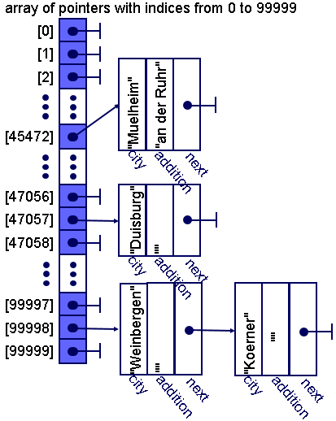

# Postal Code and City Linked List in C++

<div align="center">

</div>

## Project Overview

This project simulates the management and organization of postal codes (PLZ) and their associated cities in Germany. Using C++, it implements a dynamic data structure that reads a list of postal codes and cities from a CSV file (`plz.csv`) and stores them in a linked list. The project focuses on using pointers, linked lists, file handling, and operator overloading in C++ to effectively manage and display postal code data.

## Features

- **Linked List Implementation**: Stores cities and their additional information for each postal code as a singly linked list.
- **Operator Overloading**: Overloads the `<<` operator to print the cities associated with a specific postal code.
- **File Input**: Reads from a CSV file containing postal code information.
- **Efficient Search**: Allows for quick search and display of cities associated with a given postal code or range of postal codes.
- **Compartment Sorting**: Data is organized using a compartment sorting approach for fast, constant-time lookups of postal codes.
- 
### Usage

The program will prompt you with a menu to manage and search for city data based on postal codes. The available options include:

- **Quit the program**: Exit the program.

- **Search by postal code prefix**: Enter one to five digits of a postal code, and the program will search for all cities and towns whose postal codes match the given prefix. The results will display the full postal code along with the corresponding city or cities.

- **Search by postal code range**: Enter two complete postal codes to define a range. The program will then search for and display all cities and towns whose postal codes fall within that range.

The program uses a singly linked list to store the city names and associated postal codes, allowing for efficient storage and search operations.


## OOP Concepts Demonstrated

1. **Linked List**: The cities for each postal code are stored in a singly linked list.
2. **Operator Overloading**: The `<<` operator is overloaded to output the city data in a readable format.
3. **Dynamic Memory Management**: Dynamic allocation and deallocation of memory using pointers for the linked list nodes.
4. **File Handling**: Efficient reading of postal code data from an external file.
5. **Encapsulation**: The data and operations related to the cities and postal codes are encapsulated within the appropriate structures and functions.

### Example Program Run:
```text
POSTAL CODE CITY LIST
0 quit c search by postal code prefix f search by postal code range
your choice: c

Enter postal code prefix (1-5 digits): 123 
12300 Abenberg | Abbendorf | Abbenrode 12301 Abbenberg | Abbendorf

POSTAL CODE CITY LIST
0 quit c search by postal code prefix f search by postal code range
your choice: f

Enter the starting postal code: 10000 
Enter the ending postal code: 20000 
12300 Abenberg | Abbendorf | Abbenrode 14501 Abbendorf | Abberode 17834 Aach | Aachen ...

POSTAL CODE CITY LIST
0 quit c search by postal code prefix f search by postal code range
your choice: 0
