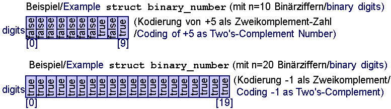

# Two's Complement Bitwise Operations with Operator Overloading


<div align="center">

</div>

## Project Overview

This project focuses on implementing two's complement bitwise operations in C++ using operator overloading. We define a custom C++ structure `binary_number` to handle large numbers in bit form, and simulate various operations on two's complement numbers. The operations include bitwise negation, two's complement conversion, addition, subtraction, and equality checks. These operations are done using overloaded operators and custom-defined functions, providing a robust understanding of two's complement numbers and how to manipulate them programmatically.

## Key Features

- **Two's Complement Representation**: Represent large numbers as an array of boolean values (0s and 1s), interpreted as two's complement numbers.
- **Operator Overloading**: Overload standard operators (`+`, `-`, `==`, `!=`, `<<`, `>>`) to perform bitwise operations and arithmetic on binary numbers.
- **Bitwise Negation and Two's Complement**: Implement bitwise negation (`!`) and two's complement (`-`) operations.
- **Addition and Subtraction**: Perform addition and subtraction of binary numbers using overloaded operators.
- **Equality and Inequality Checks**: Check whether two binary numbers are equal or unequal using overloaded equality (`==`) and inequality (`!=`) operators.
- **Zero and Negative Checks**: Implement functions `is_zero()` and `is_negative()` to check if a number is zero or negative.

## Usage

1. **Define binary_number Structure**: A `binary_number` structure represents a two's complement number with `n` bits.
2. **Operator Overloading**: Overloaded operators `+`, `-`, `==`, `!=`, `<<`, `>>` are defined to perform various operations.
3. **Menu-Driven Program**: A menu-based program allows the user to input binary numbers, perform arithmetic, and check results.

## OOP Concepts Demonstrated

- **Encapsulation**: The binary number is encapsulated within a custom structure, with access to its bits controlled by overloaded operators.
- **Operator Overloading**: Overload common C++ operators to work with the custom binary number structure, allowing intuitive operations on the two's complement numbers.
- **Abstraction**: The complex underlying operations (like addition, subtraction, and negation) are hidden from the user and accessed via simple operator symbols.
- **Dynamic Memory Management**: The binary number is stored in a dynamically allocated array to support varying sizes.

### Example Program Run:
 ```text 
TWO'S COMPLEMENT BITWISE OPERATIONS

0 quit 1 input binary number a 2 input binary number b 3 display a 4 display b 5 bitwise negation !a 6 bitwise negation !b 7 unary minus -a (two's complement) 8 unary minus -b (two's complement) 9 a + b 10 a - b 11 check if a == b 12 check if a != b 13 check if a is zero 14 check if b is zero 15 check if a is negative 16 check if b is negative

your choice: 1 Enter binary number a (length 4): 1001

your choice: 2 Enter binary number b (length 4): 0011

your choice: 3 a = 1001

your choice: 4 b = 0011

your choice: 5 !a = 0110

your choice: 7 -a (two's complement) = 0111

your choice: 9 a + b = 1100

your choice: 15 is a negative? 1
